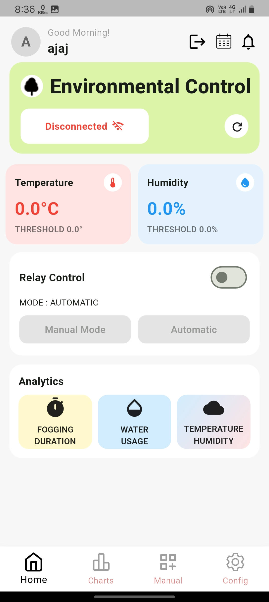
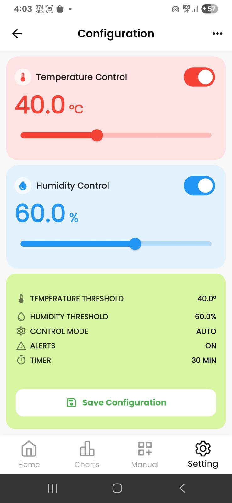
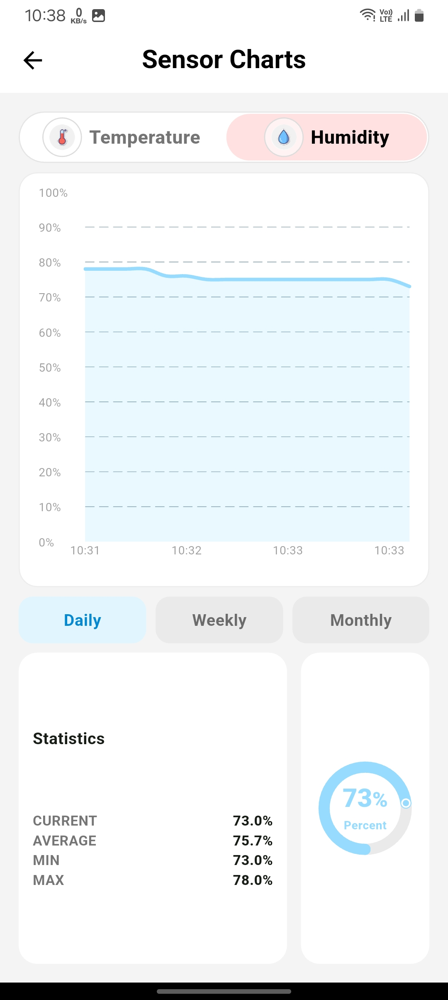
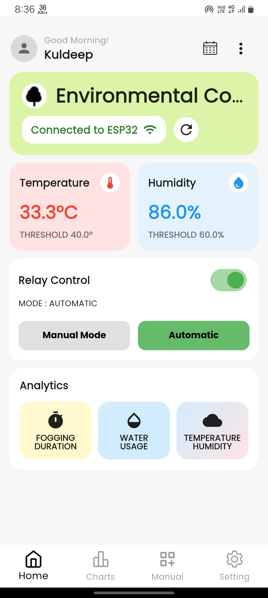

# Environmental Control App

A Flutter IoT application for monitoring and controlling environmental conditions using NodeMCU/ESP32 with DHT22 sensors.

## Features

- **Real-time Monitoring**: Live temperature and humidity readings
- **Automatic Control**: Threshold-based automatic relay control
- **Manual Control**: Direct relay control with manual mode
- **Data Visualization**: Historical data charts and statistics
- **Offline Support**: Cached data when device is disconnected
- **Configuration**: Adjustable temperature and humidity thresholds
- **Timer Control**: Scheduled relay operations

## Architecture

The app follows Clean Architecture principles with the following layers:

```
lib/
├── core/                    # Core functionality
│   ├── errors/             # Custom exceptions
│   └── network/            # API client
├── data/                   # Data layer
│   ├── models/             # Data models
│   └── repositories/       # Repository implementations
├── domain/                 # Domain layer
│   └── repositories/       # Repository interfaces
└── presentation/           # UI layer
    ├── pages/              # Screen widgets
    ├── providers/          # State management
    └── widgets/            # Reusable widgets
```

## Dependencies

### Core Dependencies
- **provider**: State management
- **http**: HTTP requests to ESP32
- **shared_preferences**: Local data caching
- **connectivity_plus**: Network connectivity checking

### UI & Visualization
- **fl_chart**: Charts and graphs
- **flutter_svg**: SVG icon support
- **intl**: Internationalization

### IoT & Network
- **wifi_iot**: WiFi connectivity
- **permission_handler**: Device permissions

### Development
- **build_runner**: Code generation
- **json_serializable**: JSON serialization
- **mockito**: Testing mocks

## Setup Instructions

### 1. Prerequisites
- Flutter SDK (>=3.10.0)
- Dart SDK (>=3.0.0)
- Android Studio / VS Code
- NodeMCU/ESP32 with DHT22 sensor

### 2. Installation
```bash
# Clone the repository
git clone <repository-url>
cd environmental_control_app

# Install dependencies
flutter pub get

# Generate JSON serialization code
flutter packages pub run build_runner build

# Run the app
flutter run
```

### 3. ESP32 Configuration
Ensure your ESP32 is configured with:
- WiFi Access Point mode (IP: 192.168.4.1)
- DHT22 sensor connected
- Relay module connected
- Web server endpoints:
  - `POST /api/data` - Get sensor data
  - `POST /api/config` - Update configuration
  - `POST /api/manual` - Manual control

### 4. Network Setup
1. Connect your device to the ESP32's WiFi network
2. The app will automatically connect to `http://192.168.4.1`
3. Ensure the ESP32 and device are on the same network

## Usage

### Dashboard
- View real-time temperature and humidity readings
- Monitor relay status and control mode
- Quick access to charts and manual control

### Configuration
- Set temperature and humidity thresholds
- Enable/disable automatic control
- Adjust update intervals

### Charts
- View historical data trends
- Analyze temperature and humidity patterns
- Check statistics (min, max, average)

### Manual Control
- Direct relay control
- Mode switching (auto/manual)
- Timer-based operations

## API Endpoints

### Get Sensor Data
```
POST /api/data
Content-Type: application/json

Response:
{
  "temperature": 25.5,
  "humidity": 60.2,
  "relayState": "OFF",
  "manualMode": false,
  "tempThreshold": 30.0,
  "humidityThreshold": 70.0,
  "tempControlEnabled": true,
  "humidityControlEnabled": true
}
```

### Update Configuration
```
POST /api/config
Content-Type: application/json

Body:
{
  "tempThreshold": 30.0,
  "humidityThreshold": 70.0,
  "tempControlEnabled": true,
  "humidityControlEnabled": true
}
```

### Manual Control
```
POST /api/manual
Content-Type: application/json

Body:
{
  "manualMode": true,
  "relayState": true
}
```

## Troubleshooting

### Connection Issues
1. Check if ESP32 is powered and running
2. Verify WiFi connection to ESP32 network
3. Ensure IP address is correct (192.168.4.1)
4. Check ESP32 serial monitor for errors

### Build Issues
1. Run `flutter clean`
2. Run `flutter pub get`
3. Run `flutter packages pub run build_runner build --delete-conflicting-outputs`

### Performance Issues
1. Reduce update interval in settings
2. Clear app cache
3. Restart the app

## Contributing

1. Fork the repository
2. Create a feature branch
3. Make your changes
4. Add tests if applicable
5. Submit a pull request

## App Screenshots

<p align="center">
  
  
  
  
  
</p>
## Support

For support and questions:
- Create an issue on GitHub
- Check the troubleshooting section
- Review ESP32 documentation
